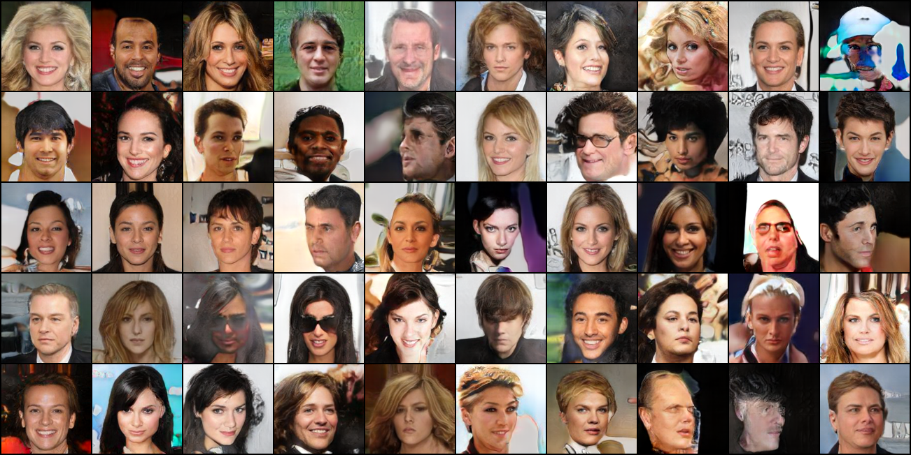
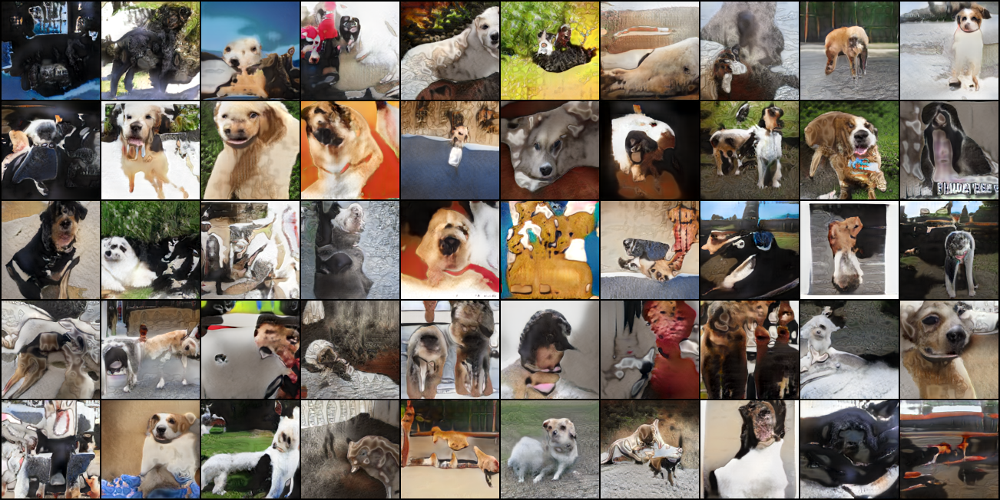

# Progressive GAN in PyTorch
Implemetatin of Progressive Growing of GANs in PyTorch

Usage:

> python train.py -d {celeba, lsun} PATH
  
Currently CelebA and LSUN dataset is supported. (Warning: Using LSUN dataset requires vast amount of time for creating index cache.)

## Sample

* Sample from the model trained on CelebA 

* Sample from the model trained on LSUN (dog)

